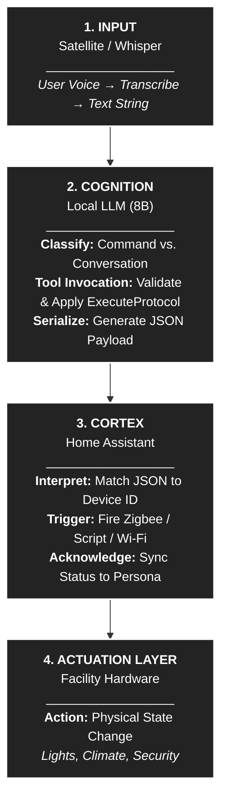

# GLaDOS Intention Engine (v3.1.1)

> **"Facility Readiness Protocol: Active."**

The **GLaDOS Intention Engine** is a local-first, modular intelligence layer designed to bridge the gap between **abstract LLM intent** and **concrete smart-home execution**. Built specifically to push the functional ceiling of the **Llama 3.1 8B** model, it uses a deterministic "Cortex" to ensure that the AI's persona remains perfectly cynical while its hardware execution remains perfectly reliable.

---

### 🧬 System Architecture



### 🧠 The Scaling Strategy

The GLaDOS Intention Engine utilizes a modular architecture to turn the 8B parameter ceiling into a structural advantage. By offloading logic validation to the **Cortex** layer, reliability becomes a product of deliberate user configuration rather than raw model probability. This ensures the system functions deterministically for your unique purpose today, while creating a resilient foundation that is ready to scale immediately should higher compute resources become available.

---

### 🛠 Hardware & Software Prerequisites

Before deploying the "Brain" yourself, ensure the following infrastructure is active within your facility:

* **The Spirit (Local LLM):** Llama 3.1 8B running via Ollama. (12gb VRAM recommended minimum)

* **The Senses (Networking):**
    * **Hypervisor:** Home Assistant (HAOS) running on KVM/QEMU.
    * **Linux Bridge (br0):** Mandatory for mDNS and device discovery.
    * **Hardware Passthrough:** Persistent ID mapping for Zigbee dongles.

* **The Logic Core:** The `glados_cortex` script (included below).

* **Required Addons:**
    * **Extended OpenAI Conversation** (via HACS).
    * **Whisper** (STT) & **Piper** (TTS).
    * **Music Assistant** (Voice Support Blueprint).

---

### 📥 TLDR Implementation Instructions (ULTRA SIMPLIFIED VERSION)

1. **System Prompt:** Copy the prompt within [system_prompt.md](system_prompt.md) (starting at `IDENTITY`, and ending after the `FINAL SYSTEM CHECK` line) into the "Prompt Template" box of your **Extended OpenAI Conversation addon.**

2. **Function Block:** Copy the `EXTENDED OPENAI CONVERSATION FUNCTIONS` block at the bottom of [system_prompt.md](system_prompt.md) into the "Functions" box of your **Extended OpenAI Conversation addon.**

3. **The Cortex:** Add `glados_cortex.yaml` as a script in Home Assistant to route LLM intents to your hardware.

4. **The Weather Satellite:** Use the **File Editor** or **Studio Code Server** addon to paste the YAML from `config/weather_satellite.yaml` into your `configuration.yaml`.

5. **Music Assistant Voice Script** should be installed by following the instructions inside [system_prompt.md](system_prompt.md).

6. ***If*** using smart lightbulbs, set them to `PreviousValue` or the equivalent.

7. **The Memory Module** follow the above instructions to implement a way for GLaDOS to remember basic information beyond her contextual memory in your VRAM.

8.  **Customize:** The information in this repository will show you how to tailor the GLaDOS Intention Engine to your specific facility hardware!
      (that's the fun part)

---

### 📚 Advanced Documentation

To find the full "GLaDOS" prompt, details on configuration, logic modification, and sensor calibration, refer to each individual document for more detailed information about their functions, and when any edits would be necessary:

* **[The Brain (System Prompt) and the Hands (Functions) ](system_prompt.md):** Detailed behavioral constraints, response protocols, and personality tuning.

* **[The Nervous System (Cortex)](glados_cortex.md):** Advanced routing logic, hardware mapping, and error handling.

* **[The Weather Satellite](weather_satellite.md):** Comprehensive sensor configuration and forecasting logic.

---

### 📥 Installation Procedure (The "Logic Triad")

To establish baseline functionality, you must align three core components: the **Brain** (Prompt), the **Hands** (Function Block), and the **Nervous System** (Cortex).

#### 1. The Weather Satellite (Temporal Context)

*Give GLaDOS the ability to see the future.*

Add the following to your `configuration.yaml`. This creates a sensor that fetches *daily* forecast data (which standard entities hide) and feeds it to the AI context.

```yaml
# configuration.yaml
template:
  - trigger:
      - platform: time_pattern
        hours: "/1"             # Refresh data every hour
      - platform: homeassistant
        event: start            # CRITICAL: Ensures data exists immediately after reboot
    action:
      - action: weather.get_forecasts
        target:
          entity_id: weather.forecast_home  # <--- UPDATE THIS if your entity is different
        data:
            type: daily
        response_variable: weather_data
    sensor:
      - name: "GLaDOS Weather Context"
        unique_id: glados_weather_context
        state: "{{ now().strftime('%H:%M') }}"
        icon: mdi:satellite-uplink
        attributes:
          forecast: "{{ weather_data['weather.forecast_home'].forecast }}"
```


---


#### 2. The Cortex (Nervous System)

*The router that translates "Intent" into "Action".*

Create a new script in Home Assistant named `script.glados_cortex`. Paste the full YAML from `glados_cortex.md` (or the repository file). This script handles the `ExecuteProtocol` logic.

**Critical Configuration Note:**
> Ensure you replace placeholders like `YOUR_TV_DEVICE_ID_HERE` and `media_player.squeeze_lx` with your actual entity IDs.

#### 3. The Brain (System Prompt)

*The personality and logic constraints.*

Copy the contents of `system_prompt.md` into the **Prompt Template** field of the **Extended OpenAI Conversation** addon.

**Key Features:**
* **Facility Status Report:** Injects real-time sensor data (Time, Solar, Weather, Hardware).
* **Sequential Processing:** Handles complex requests ("Turn on the TV *and* set lights to blue").
* **Logic Gate:** Forces the AI to verify conditions (e.g., "Only if it's dark") *before* acting.


---


#### 4. The Hands (Function Block)
*The tool definition allowing the AI to "press buttons".*

Copy this block into the **Functions** field of the Extended OpenAI Conversation addon:

```yaml
- spec:
    name: ExecuteProtocol
    description: Executes a facility protocol via the central Cortex router.
    parameters:
      type: object
      properties:
        intent:
          type: string
          enum: ["SLEEP", "THINKBOX", "PC", "PS5", "TV_MODE", "TV_ON", "TV_OFF", "MUSIC", "MUSIC_PAUSE", "MUSIC_RESUME", "MUSIC_SKIP", "VOICE_ONLY", "LIGHTS", "LIGHTS_OFF"]
          description: The abstract protocol code.
        payload:
          type: string
          description: Media name, search string, or target room for lights.
        media_type:
          type: string
          enum: ["track", "album", "artist", "playlist", "radio"]
          description: Required for intent="MUSIC". Defines the search scope.
        shuffle:
          type: boolean
          description: Optional. Default is false.
        brightness_pct:
          type: integer
          description: Target brightness (1-100). Optional for LIGHTS.
        hs_color:
          type: array
          minItems: 2
          maxItems: 2
          items:
            type: number
          description: Target color [Hue, Saturation]. Optional for LIGHTS.
      required:
        - intent
  function:
    type: script
    sequence:
      - action: script.glados_cortex
        data:
          intent: "{{ intent }}"
          payload: "{{ payload | default('') }}"
          media_type: "{{ media_type | default('track') }}"
          shuffle: "{{ shuffle | default(false) }}"
          brightness_pct: "{{ brightness_pct | default(none) }}"
          hs_color: "{{ hs_color | default(none) }}"
```


---


### 🔧 Customization: The "Triad" Expansion Guide

To add a new capability (e.g., "Open the Garage"), you must maintain synchronization across the **Logic Triad**. Failure to align all three files will result in a "Ghost Signal" (GLaDOS thinks she acted, but your hardware does nothing).

1. **System Prompt:** Add `intent="GARAGE"` to the `ENUM ADHERENCE` list so the Brain knows the concept exists.

2. **Function Block:** Add `"GARAGE"` to the `enum` list in the tool definition so the Brain has a button to press.

3. **Cortex Script:** Add a `condition` block to `script.glados_cortex` so the Nervous System knows which wire to pull.

```yaml
      # Example Cortex Addition for Garage
      - conditions:
          - condition: template
            value_template: "{{ intent == 'GARAGE' }}"
        sequence:
          - action: cover.open_cover
            target:
              entity_id: cover.garage_door
```


---


### 🧠 The Memory Module

*Give GLaDOS a place to store short-term data about her test subjects.*

You must create a specific `input_text` helper to serve as the variable container for the `Subject_Memory` field used in the System Prompt.

#### Method A: The UI Way (Easiest)

1. Go to **Settings > Devices & Services > Helpers**.

2. Click **+ Create Helper** and select **Text**.

3. **Name:** `Memory General`

4. **Entity ID:** Ensure it generates as `input_text.memory_general`.

5. **Max Length:** Set to `255` (this is the hard limit for Home Assistant text states).

6. **Icon:** `mdi:brain` (optional).


---


### ⚠️ The "Empty Seat" Protocol (Voice)

Due to recent updates in Piper, custom voices require a specific workaround:

1. **Rename** your custom GLaDOS `.onnx` and `.json` files to `en_US-ryan-medium.onnx` (and `.json`).
2. **Place** them in the `/share/piper` directory on your HA instance.
3. **Disable** "Update Voices" in the Piper addon configuration to prevent it from overwriting your custom files.


---


### 🛡 Security & Privacy

* **100% Local:** No voice data, intent processing, or video feeds leave your local network.
* **Deterministic Execution:** The Cortex acts as a firewall for logic. The AI cannot "hallucinate" a device ID; it can only request an abstract intent (e.g., `LIGHTS`), which the Cortex strictly maps to physical entities.


---


> *"I am detecting significant neural decay in that request. Ignoring."* — GLaDOS
