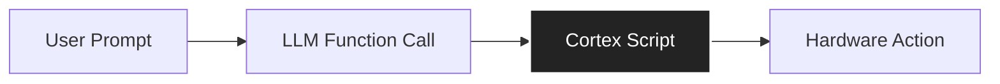

# GLaDOS Cortex (v3.1.1)
> **The Central Nervous System**

The **Cortex** is a specialized script within Home Assistant that acts as the primary **Logic Router** for the GLaDOS Intention Engine. While the LLM itself determines *what* needs to happen (the Intent), the Cortex determines *how* to execute it on your specific hardware (the Action).

### 📐 Logic Flow




### 🛡 Why This Exists

***This separation of concerns protects your facility:***

1.  **Deterministic Control:** The AI cannot "hallucinate" a device ID. It can only trigger pre-approved intent codes defined in this script.

2.  **Latency Optimization:** Complex logic (like checking which room you are in) happens locally in milliseconds, not in any corporate cloud services.

3.  **Concurrency:** The script runs in `parallel` mode, allowing the system to handle multi-step instructions (e.g., "Turn on the TV *and* dim the lights") without one action blocking the other.


---

***All the information from here will give you an understanding of how to "plug-in" the template **Cortex**, and then customize it from there. Or alternatively, write your own version entirely.*** 

---


### 🧠 The Core Logic Script
*Copy the YAML block below and paste it into a new Script in Home Assistant. Name the script entity `script.glados_cortex`.*


```yaml
alias: GLaDOS Cortex (Intention Engine Router)
description: >-
  The central nervous system for the GLaDOS Intention Engine (v3.1.1).
  Routes LLM-determined 'intents' to physical hardware actions using 
  deterministic logic gates.
mode: parallel
max: 10
fields:
  intent:
    description: The abstract protocol code (e.g., LIGHTS, MUSIC, SLEEP).
    example: LIGHTS
  payload:
    description: The target device, room, or search string.
    example: living room
  media_type:
    description: (Optional) Music search scope (artist, album, playlist).
    example: playlist
  brightness_pct:
    description: (Optional) Target brightness for lighting arrays (1-100).
    example: 50
  hs_color:
    description: (Optional) Target color for lighting arrays [Hue, Saturation].
    example: [0, 100]
  shuffle:
    description: (Optional) Boolean to randomize auditory stimuli.
    example: true

sequence:
  # ----------------------------------------------------------------------
  # 1. LOGIC GATE: INTENT ROUTING
  # ----------------------------------------------------------------------
  - choose:
      
      # ------------------------------------------------------------------
      # PROTOCOL: CIRCADIAN REGULATION (Sleep)
      # ------------------------------------------------------------------
      - conditions:
          - condition: template
            value_template: "{{ intent == 'SLEEP' }}"
        sequence:
          # Replace with your actual TV/Remote Device ID
          - action: remote.turn_off
            target:
              device_id: YOUR_TV_DEVICE_ID_HERE 
          - action: light.turn_off
            target:
              entity_id: all

      # ------------------------------------------------------------------
      # PROTOCOL: DISTRACTION UNIT (TV Control)
      # ------------------------------------------------------------------
      - conditions:
          - condition: template
            value_template: "{{ intent == 'TV_ON' or intent == 'TV_MODE' }}"
        sequence:
          - action: script.turn_on_tv # Calls a local sub-script for WOL/IR
      - conditions:
          - condition: template
            value_template: "{{ intent == 'TV_OFF' }}"
        sequence:
          - action: remote.turn_off
            target:
              device_id: YOUR_TV_DEVICE_ID_HERE

      # ------------------------------------------------------------------
      # PROTOCOL: COGNITIVE ANCHORS (PC / ThinkBox / PS5)
      # ------------------------------------------------------------------
      - conditions:
          - condition: template
            value_template: "{{ intent == 'PC' }}"
        sequence:
          - action: script.direct_switch_to_think_box_anchor
      - conditions:
          - condition: template
            value_template: "{{ intent == 'THINKBOX' }}"
        sequence:
          - action: script.switch_to_thinkbox
      - conditions:
          - condition: template
            value_template: "{{ intent == 'PS5' }}"
        sequence:
          - action: script.direct_switch_to_games_anchor

      # ------------------------------------------------------------------
      # PROTOCOL: AUDITORY STIMULI (Music Assistant)
      # ------------------------------------------------------------------
      - conditions:
          - condition: template
            value_template: "{{ intent == 'MUSIC' }}"
        sequence:
          - action: script.music_assistant_voice_control
            data:
              media_id: "{{ payload }}"
              media_type: "{{ media_type | default('track') }}"
              # Enriches the metadata for dashboard display
              media_description: "Auditory experiment: {{ payload }}" 
              shuffle: "{{ shuffle | default(false) }}"
              mass_player: media_player.squeeze_lx # <- DEFINE YOUR DEFAULT MEDIA PLAYER IN THIS LINE. 

      # ------------------------------------------------------------------
      # PROTOCOL: MUSIC TRANSPORT (Pause/Resume/Skip)
      # ------------------------------------------------------------------
      - conditions:
          - condition: template
            value_template: "{{ intent in ['MUSIC_PAUSE', 'MUSIC_RESUME', 'MUSIC_SKIP'] }}"
        sequence:
          - action: >-
               media_player.media_pause 
               media_player.media_play 
               media_player.media_next_track 
              
            target:
              entity_id: media_player.squeeze_lx

      # ------------------------------------------------------------------
      # PROTOCOL: LIGHTS (Luminous Emission Arrays)
      # ------------------------------------------------------------------
      - conditions:
          - condition: template
            value_template: "{{ intent == 'LIGHTS' }}"
        sequence:
          - variables:
              safe_payload: "{{ payload | default('') | lower }}"
              # AREA MAPPING: Add your rooms here
              # NOTE: Default Fallback is 'living_room' to prevent logic errors on vague inputs.
              target_area: >-
                 bedroom 
                 kitchen
                 living_room 
                
              # LOGIC GATES: Check if parameters exist before sending
              has_color: >-
                {{ hs_color is defined and hs_color is not none and not
                (hs_color == [0, 0] and 'white' not in safe_payload) }}
              has_brightness: "{{ brightness_pct is defined and brightness_pct is not none }}"
          
          # EXECUTION: Send only the necessary data to prevent "State Reset" (Flashbangs)
          - choose:
              - conditions: "{{ has_color and has_brightness }}"
                sequence:
                  - action: light.turn_on
                    target:
                      area_id: "{{ target_area }}"
                    data:
                      hs_color: "{{ hs_color }}"
                      brightness_pct: "{{ brightness_pct }}"
              - conditions: "{{ has_color }}"
                sequence:
                  - action: light.turn_on
                    target:
                      area_id: "{{ target_area }}"
                    data:
                      hs_color: "{{ hs_color }}"
              - conditions: "{{ has_brightness }}"
                sequence:
                  - action: light.turn_on
                    target:
                      area_id: "{{ target_area }}"
                    data:
                      brightness_pct: "{{ brightness_pct }}"
            default:
              - action: light.turn_on
                target:
                  area_id: "{{ target_area }}"

      # ------------------------------------------------------------------
      # PROTOCOL: LIGHTS_OFF
      # ------------------------------------------------------------------
      - conditions:
          - condition: template
            value_template: "{{ intent == 'LIGHTS_OFF' }}"
        sequence:
          - action: light.turn_off
            target:
              area_id: >-
                  
                 bedroom  
                 kitchen
                 living_room 
                
```


---


### 🔧 BASELINE FUNCTIONALITY/Expansion Guide (Adding New Capabilities after you get it working)

To add a new capability/intent ("Open the Garage"), you must maintain synchronization across the **Logic Triad**. Failure to align all three files will result in a "Ghost Signal", where GLaDOS thinks she acted correctly, but no hardware responds.


#### The Alignment Checklist:

1.  **System Prompt (`system_prompt.md`):** Add `intent="GARAGE"` to the ENUM list so the Brain knows the concept exists.

2. **Training Examples (`system_prompt.md`):** Build new training examples for GLaDOS, so she is aware of the desired results for the new intent.  

3.  **Function Block (`system_prompt.md`):** Add `"GARAGE"` to the `enum` list in the tool definition so the Brain has a button to press.

4.  **Cortex (`glados_cortex.yaml`):** Add the routing logic below so the Nervous System knows which wire to pull.

**The Result:** Saying "Open the landing bay doors" will let GLaDOS open your garage door, and say something snarky back to you.

---

### 🛠 How to Edit the Cortex

You can edit the Cortex in two ways: via the **Visual Editor (UI)** for ease of use, or via **YAML** for speed and precision.

#### Option A: The Visual Editor (UI) Method

*Best for users who are uncomfortable with code syntax.*

1.  Navigate to **Settings > Automations & Scenes > Scripts** and open `glados_cortex`.

2.  Scroll down to the main **Choose** block (labeled "Sequence").

3.  Click the **+ Add Option** button at the bottom of the list.

4.  **Conditions:**
    * Click **Add Condition** → select **Template**.
    * Paste the trigger logic: `{{ intent == 'GARAGE' }}`

5.  **Actions:**
    * Click **Add Action** → select **Device** or **Call Service**.
    * Select your hardware (e.g., `cover.garage_door` → `Open`).

6.  Click **Save Script**.

---

#### Option B: The YAML Method (Usually better, enables more accuracy)

*Best for speed and complex logic.*

1.  Open the script in **YAML Mode** (three dots top-right → Edit in YAML).

2.  Scroll to the `choose:` block.

3.  Paste the following block directly before the `default:` or last item:

```yaml
      # ------------------------------------------------------------------
      # PROTOCOL: GARAGE (Vehicle Bay)
      # ------------------------------------------------------------------
      - conditions:
          - condition: template
            value_template: "{{ intent == 'GARAGE' }}"
        sequence:
          - action: cover.open_cover
            target:
              entity_id: cover.main_garage_door
          - action: notify.mobile_app_phone
            data:
              message: "Vehicle bay transport assembly activated."
```


4.  Click **Save**.


---


### ⚠️ Common GLaDOS Cortex Deployment Errors

1.  **Renaming the Script:**
    The Function block specifically calls `script.glados_cortex`. If you rename this script entity to anything else (e.g., `script.my_ai_logic`) without updating the Function definition, the system will fail silently.

2.  **Forgotten Placeholders:**
    Ensure you have replaced `YOUR_TV_DEVICE_ID_HERE` and `media_player.squeeze_lx` in the YAML with your actual Entity IDs. If these placeholders remain, the script will error out when triggered.

3.  **Ambiguous Room Names:**
    If a user says "Turn on the lights" without specifying a room, this script logic defaults to `living_room`. If you do not have a `light.living_room` entity, you must update the default fallback in the Cortex YAML to a valid entity (e.g., `light.bedroom`).

4.  **Enum Synchronization (The Ghost Signal):**
    If you add a new Intent to this Cortex script (e.g., "GARAGE") but fail to add `"GARAGE"` to the `enum` list in the OpenAI **Function Block**, the AI will never trigger the action. The Brain and the Nervous System must always match.


---
ADDITIONAL TIP:
---


### 🤖 Recursive Improvement (Self-Diagnostics)

Because GLaDOS operates on a transparent logic schema defined in her System Prompt, she possesses an interesting **Meta-Capability**: she understands her own architecture well enough to assist in her own expansion.

This serves as an accurate and entertaining way to draft ideas for expanding her administrative capabilities within your facility.

It also allows **Beginner Users** to install the Template Cortex directly into HAOS and have GLaDOS "help" fix or expand her own system without needing to rewrite complex code from scratch.

**⚠️ CAUTION:**
Her self-diagnostic behavior is **NOT** the primary method of debugging or expansion. She **IS** wrong sometimes. While this feature can be fun and useful, you must exercise **EXTREME CAUTION**. She is not always accurate in her "self-diagnostic" abilities. It's the neuro-toxin contaminants, be nice to her.

**FINAL WARNING:**
If you do use this method, review the examples below to learn which assistance from GLaDOS constitutes **GOOD ADVICE** vs. **BAD ADVICE**. This will also teach you what *not* to do when customizing the system yourself.

---

#### ✅ The Right Way: "Enum Expansion"

If you are unsure how to structure a JSON payload for a new tool (e.g., a Vacuum, Garage Door, or Sprinkler System), you can try asking her for help during a chat session.

> **User:** "If I wanted to give you a new intent to open the garage door, how would I do that?"
>
> **GLaDOS (Actual Response):** "To add a new intent, we need to modify the existing function call structure and update the Cortex router... Here's an example of how you could define a new function call:"
> ```json
> {
>   "name": "ExecuteProtocol",
>   "parameters": {
>     "intent": "GARAGE",
>     "payload": "garage door"
>   }
> }
> ```

**✅ Why This Example Is GOOD ADVICE:**

As shown above, GLaDOS correctly identified the three requirements for expansion without being explicitly trained on "Garage Doors":

1.  **Enum Update:** She knew the `intent` required a new flag in the Function Block.

2.  **Cortex Update:** She referenced the need to update the "Cortex router" (the YAML script).

3.  **Payload Structure:** She generated a syntactically perfect JSON object that reuses the existing `ExecuteProtocol` architecture.

---

#### ⛔ Examples of BAD ADVICE: "Function Sprawl"

**CRITICAL WARNING:** When asked to expand capabilities, GLaDOS may occasionally suggest creating **New Function Calls** (e.g., `ExecuteFanProtocol` or `ExecuteVacuum`).

**IGNORE THIS ADVICE.**

* **The Trap:** She is suggesting you add a new block to the **Extended OpenAI Conversation "Functions" field**.

* **Why it fails:** Her architecture relies on a **Single Point of Entry** (`ExecuteProtocol` -> `script.glados_cortex`). If you create a new function, you break the "Central Nervous System" design and force yourself to create and maintain separate scripts for every single device type.

* **The Correct Method:** Always force her to expand the **Existing Enum** within `ExecuteProtocol`.
    * *Wrong:* New Function `ExecuteFanProtocol`
    * *Right:* `ExecuteProtocol(intent="FAN")`

---

#### ⚠️ Logic Warning: "Parameter Drift"

Sometimes GLaDOS will hallucinate parameters that do not exist for a specific device because she is trying to be "too helpful."

> **User:** "How do I add a fan?"
> **GLaDOS (Bad Response):** `ExecuteProtocol(intent="FAN", hs_color=[240, 100])`

**Why This Is BAD Advice:**
* **The Error:** Fans do not have "Hue/Saturation" color settings. She drifted from "Controlling a Device" to "Controlling a Light."
* **The Fix:** You must manually sanitize her suggestions. Ensure the physical device actually supports the parameters she tries to assign to it (e.g., use `brightness_pct` for Fan Speed, but delete `hs_color`).

*Use this recursive capability to "draft" code for your own custom intents, but always verify the logic against the **Logic Triad** before deploying.*

*Simplified TL;DR:*

**WHAT ADVICE TO FOLLOW FROM GLADOS IF YOU USE THIS METHOD FOR REPAIRS:** You should only follow her guidance when she suggests a solution that expands the existing intent list within the single `ExecuteProtocol` tool and maps it to a corresponding logic gate within the `glados_cortex` router.
---

